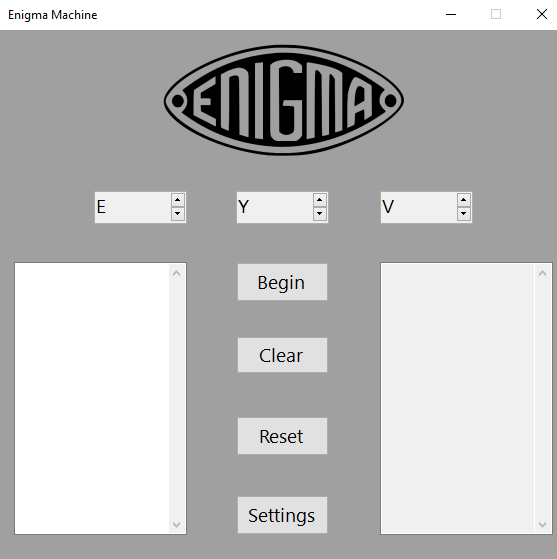

## Описание

- **Назначение**: графический симулятор шифровальной машины Enigma (Windows Forms, C#).
- **Архитектура**: главная форма ввода/вывода (Form1), форма настроек (Form2), классы роторов, рефлектора, коммутационной панели и преобразования текста.

## Требования

- **.NET SDK**: 3.1 и выше (подойдёт любой SDK, умеющий собирать netcoreapp3.1, например .NET 6/7/8/9).
- **ОС**: Windows (приложение Windows Forms).

## Структура проекта

```
enigma/
  enigma.sln
  README.md
  .gitignore
  enigma/                    # проект
    Program.cs               # точка входа
    enigma.csproj
    Forms/                   # формы
      Form1.cs, Form1.Designer.cs, Form1.resx   # главное окно
      Form2.cs, Form2.Designer.cs, Form2.resx   # настройки
    Core/                    # логика Enigma
      Rotors.cs              # ротор, поворот, Shifr/R_Shifr
      Commutation.cs         # рефлектор и коммутационная панель
      Data.cs                # InPut, OutPut (A–Z <-> 0–25)
    Data/                    # данные
      DataBank.cs            # проводки роторов/рефлектора/панели, Information
    Properties/
      Resources.resx, Resources.Designer.cs      # ресурсы, логотип
```

## Как собрать и запустить из командной строки

1. Открыть PowerShell или CMD.
2. Перейти в папку с решением: cd в папку code\enigma.
3. Собрать: dotnet build enigma.sln
4. Запустить: dotnet run --project enigma\enigma.csproj (из корня решения) или cd enigma\enigma и dotnet run.

Откроется окно Enigma Machine.

## Как собрать и запустить в Visual Studio

Открыть enigma.sln, Debug, Any CPU, F5 или Ctrl+F5.

## Как пользоваться

1. Settings — выбор роторов (Rotor_I … Rotor_VIII, Beta_Rotor, Gamma_Rotor), рефлектора (Reflector_B/C, Reflector_B_Dunn, Reflector_C_Dunn), коммутационной панели (PB_A, PB_B, PB_C). Save.
2. Положения роторов: три поля UpDown1, UpDown2, UpDown3 (по умолчанию A–A–A).
3. Ввести текст A–Z в левое поле, Begin — результат в правом.
4. Clear — очистка полей, Reset — сброс роторов в A–A–A.

## Внутренняя логика

Строка -> числа 0–25 (InPut). Для каждого символа: поворот роторов, коммутационная панель -> три ротора -> рефлектор -> обратно роторы -> коммутационная панель. Результат -> буквы (OutPut).

## Замечания

Целевая платформа netcoreapp3.1. Папки bin и obj создаются при сборке.